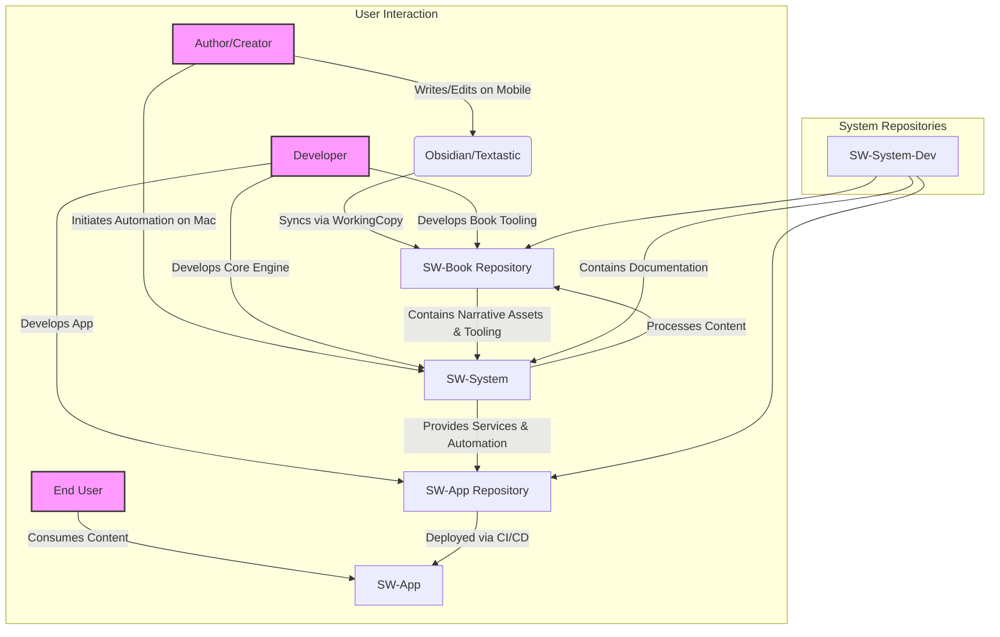

# SagasWeave Architecture Design

## 1. Introduction

This document outlines the technical architecture of the SagasWeave platform, based on the [SagasWeave-Overall-PRD.md](../prd/SagasWeave-Overall-PRD.md). The architecture is designed to be modular, scalable, and AI-centric, supporting an automated workflow for creating and publishing interactive narratives.

## 2. Core Principles

-   **Modularity & KISS (Keep It Simple, Stupid)**: The system is divided into distinct, independent repositories with clear responsibilities. This promotes separation of concerns, minimal complexity, and allows for independent development.
-   **Automation**: Workflows are heavily automated using scripts and CI/CD pipelines to minimize manual intervention, ensure consistency, and enable rapid project setup.
-   **AI-Optimized**: The architecture is built to seamlessly integrate AI through template-driven development, standardized patterns, and custom MCP Servers.
-   **Content as Code**: Narrative content is treated as code—managed in Git, versioned, and processed through automated pipelines.

## 3. High-Level Architecture

SagasWeave employs a multi-repository architecture where each repository represents a core component. These components work together to provide a comprehensive platform for narrative creation and consumption.



## 4. Repository Breakdown

### 4.1. `SW-System` (Core Engine)

-   **Purpose**: The central engine and automation hub. It provides reusable infrastructure and development tools.
-   **Responsibilities**: Core architecture, development automation (build, deploy, CI/CD), code quality enforcement, service template provisioning, and hosting the AI integration server (MCP).
-   **Structure**:
    ```
    SW-System/
    ├── engine/              # Core reusable components
    ├── init-scripts/        # Project initialization tools (e.g., 'sw-init')
    ├── service-templates/   # Reusable service patterns (API, frontend, etc.)
    ├── automation/          # Cross-project automation scripts
    ├── shared-configs/      # Common configurations (Biome, Vitest)
    └── docs/                # Technical documentation
    ```

### 4.2. `SW-Book` (Content Creation)

-   **Purpose**: Author-focused repository for content creation and publishing.
-   **Responsibilities**: Storing narrative content (Markdown/MDX), manuscript management, and housing the publishing automation pipeline and author-specific tools.
-   **Structure**:
    ```
    SW-Book/
    ├── narratives/         # Stories, manuscripts, characters
    ├── publishing/         # Publishing automation pipeline
    ├── writing-tools/      # Author-specific automation
    └── services/           # Content-specific services from SW-System templates
    ```

### 4.3. `SW-App` (Product Application)

-   **Purpose**: The user-facing application that presents the interactive narrative.
-   **Responsibilities**: Rendering content, providing the UI/UX, handling user interactions, and managing client-side state.
-   **Structure**:
    ```
    SW-App/
    ├── src/                # Application source code
    ├── components/         # Reusable UI components
    ├── features/           # Product-specific features
    └── services/           # App-specific services from SW-System templates
    ```

### 4.4. `SW-System-Dev` (Development Hub)

-   **Purpose**: Central hub for development coordination, project documentation, and sprint planning.
-   **Responsibilities**: Housing high-level documentation (PRDs, architecture), sprint plans, repository organization, and AI interaction logs.
-   **Structure**:
    ```
    SW-System-Dev/
    ├── docs/               # Architecture, design, and process docs
    ├── sprints/            # Sprint planning and tracking
    └── chatGpt/            # AI interaction logs and summaries
    ```

## 5. Workflow and Automation

### 5.1. Initialization Flow

A developer can quickly scaffold a new project using a command-line tool from `SW-System`:

```bash
# Example: Initialize a new book project with specific services
sw-init --project=book --services=content,publishing

# Example: Initialize a new app project
sw-init --project=app --services=frontend,api
```

This relies on a **Service Template System** where core service templates (e.g., API, frontend) are defined in `SW-System` and customized for specific projects.

### 5.2. Content-to-App Workflow

1.  **Creation**: An author creates/edits narrative content in Markdown and syncs it to the `SW-Book` repository.
2.  **Automation**: A developer or an automated process runs a script from `SW-System`.
3.  **Processing**: The script pulls content from `SW-Book`, validates it, transforms it (e.g., Markdown to JSON), and prepares it for the application.
4.  **Integration**: The processed content is integrated into the `SW-App` repository.
5.  **Deployment**: Changes to `SW-App` trigger a CI/CD pipeline (e.g., GitHub Actions) that builds and deploys the application.

## 6. Technology Stack

-   **Core**: Node.js (LTS), TypeScript, Biome (linting/formatting), Vitest (testing).
-   **Development Tools**: Git Submodules, VS Code.
-   **Automation & AI**: AST-grep & Comby (code transformation), Custom MCP Servers for AI service integration.
-   **Content**: Markdown/MDX, Obsidian, Textastic, Working Copy.
-   **Application**: React, Vite.

## 7. Benefits

-   **For Developers**: Rapid project setup, consistent patterns, reusable components, and automated quality checks.
-   **For Content Creators**: Specialized tools, automated content management, and a streamlined publishing pipeline.
-   **For AI Assistance**: A predictable, template-based structure and standardized conventions for easier integration and code generation.

## 8. Future Vision: VPS Automation

The system is designed to eventually run headlessly on a Virtual Private Server (VPS). This will enable a fully automated CI/CD pipeline where changes pushed to `SW-Book` are automatically processed and deployed without manual intervention.